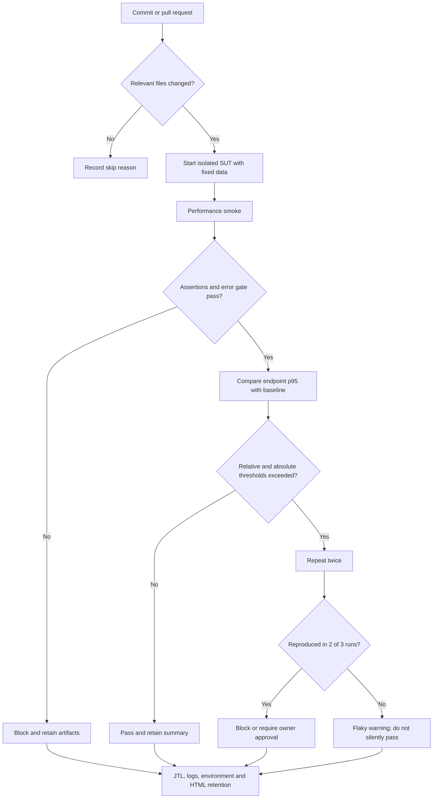

# Continuous Performance Testing Proposal for EShop

Status: proposal only; this pipeline has not been implemented.

## Decision flow

## Gates

Every run records commit, environment fingerprint, fixed dataset version and JMeter version. The smoke gate requires all assertions and an error rate below 1%. Regression evaluation uses both an absolute service objective (initially p95 < 2,000 ms) and a relative comparison against a controlled baseline (initially no more than 15% p95 regression). A relative breach is repeated twice; two reproductions among three total runs trigger block/approval. Thresholds are starting policy values, not claims that the current laptop is a CI reference.

## Cadence

- Pull request: changed-file filter, short smoke on affected endpoints; target under 5 minutes.
- Nightly: Load plus calibrated Registration and coupon burst, repeated when a regression is detected.
- Weekly: 10-minute Endurance and wider Stress staircase on a reserved runner.

## Cost, noise and maintenance

Shared CI creates noisy-neighbor effects, so the runner should be isolated or tagged and the SUT/load generator separated when possible. Repetitions reduce false alarms but increase pipeline time and compute cost. Blocking every single relative regression would slow delivery; the two-of-three rule plus explicit owner approval balances protection and investigation. Baselines must be versioned and refreshed only after an intentional, reviewed behavior or environment change—not automatically after a slow run. Retain failed-run JTL/HTML/log/resource artifacts for 30 days and passing summaries for 14 days; retain accepted weekly baselines longer.

Skip paths, flaky warnings and approvals remain visible so teams cannot bypass performance testing silently.
