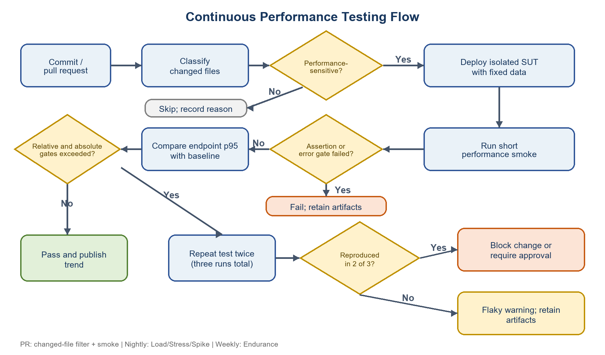

# HW05 — Performance Testing Report

**Student:** NGUYỄN QUANG THÁI  
**Student ID:** 23127116  
**Class:** 23KTPM2  
**Version / execution date:** 1.0 / 2026-08-18

## Executive summary

Apache JMeter 5.6.3 tested three independent EShop groups: read-heavy `GET /api/products`, auth-heavy `POST /api/register`, and transactional `POST /api/admin/coupons`. Load passed with p95 3 ms. Registration Stress had 0% errors but failed the working two-second latency gate at p95 2,473.40 ms. Coupon Spike p95 rose to 1,316.10 ms and returned to 17.80 ms. A ten-minute Products Endurance run sustained 481.001 post-ramp requests/s at p95 4 ms with no errors.

## 1. Scope and endpoint mapping

| Scenario | Endpoint | Group | Rationale |
|---|---|---|---|
| Load | `GET /api/products` | Read-heavy | Repeated searches read product rows without state changes. |
| Stress | `POST /api/register` | Auth-heavy | Account-registration workflow creates identities. |
| Spike | `POST /api/admin/coupons` | Transactional | Authenticated coupon creation performs database writes. |

**Manual TODO:** obtain the required endpoint/workflow uniqueness confirmation for the student group.

## 2. Environment and attribution

| Item | Observed value |
|---|---|
| Host | `LAPTOP-BKI58MTI`, Lenovo 82JW |
| OS | Windows 11 Home Single Language 64-bit, build 26200.9168 |
| CPU / RAM | Ryzen 5 5600H, 6 cores/12 logical; 16 GiB |
| Disk | Samsung NVMe SSD, about 476.94 GiB |
| Java / JMeter | Temurin 17.0.19+10 / JMeter 5.6.3 |
| SUT | commit `85af3ba875c88283615e22cb108f13e2fccaf0e9` plus recorded dirty runtime DB |

SUT and generator shared the laptop. Whole-system CPU/memory therefore cannot be attributed exclusively to Node/SQLite. No SUT source was changed.

## 3. Data and JMX design

Each group has a separate CSV and JMX plan. Registration emails receive a runtime UUID; coupon codes receive unique `PERF_` values. Assertions verify expected HTTP behavior. Official tests ran non-GUI, wrote raw CSV JTL, HTML dashboard, JMeter log and resource CSV, and cleaned only generated records. Credentials were process-only and are absent from tracked plans/evidence.

## 4. Baseline and calibration

All three plan checks completed without assertion errors after startup effects were separated. Registration calibration showed 53.598 RPS at 25 users, 134.958 at 100, 135.065 at 200 and 137.503 at 400. p95 rose from 40.95 ms to 6,014.60 ms and 400 users produced 3.463% errors. This is an observed plateau near 135 RPS for that short profile—not a universal guarantee.

Products calibration produced 2,443.629, 2,518.079 and 2,529.031 RPS at 25/50/100 users, while p95 rose 14/26/50 ms. Fifty users was selected conservatively for Endurance.

## 5. Official results

| Scenario | Samples | Error | Throughput | Average | p95 | p99 | Decision |
|---|---:|---:|---:|---:|---:|---:|---|
| Load | 1,045 | 0.000% | 8.914 RPS | 1.61 ms | 3 ms | 3 ms | Pass |
| Stress | 11,213 | 0.000% | 183.877 RPS | 1,515.37 ms | 2,473.40 ms | 2,802.76 ms | Fail latency |
| Spike burst | 1,247 | 0.000% | 140.302 RPS | 390.91 ms | 1,316.10 ms | 1,540 ms | Pass |
| Endurance post-ramp | 274,040 | 0.000% | 481.001 RPS | 2.11 ms | 4 ms | 9 ms | Pass for 10 min |

Spike baseline/recovery p95 was 18.00/17.80 ms, demonstrating recovery in this run. Endurance final-window p95 rose from 2 to 8 ms and throughput fell 3.74% relative to the first window, but remained far within the latency objective with no failures.

## 6. Resource interpretation and threshold

Endurance backend working-set averages were 86.26 MB in the first and 86.46 MB in the last post-ramp minute. This does not show material backend-memory growth over ten minutes. Host-wide available memory and CPU were affected by JMeter/report generation. A provisional controlled-run gate is error rate <1%, p95 <2,000 ms, and Products post-ramp throughput ≥430 RPS; it must be re-baselined on a dedicated runner.

## 7. AI review and optimization

The preserved first pass was audited against raw labels/timestamps. It correctly separated errors from latency and Spike phases, but human review tightened workload comparability and causality. WAL and an email index are feasible Registration experiments. A coupon-code index is redundant because the column is UNIQUE; a generic pool does not fit a single SQLite handle; extra RAM and Redis lack current evidence. Parameterized product search is a security/correctness fix whose speed effect remains unproven.

## 8. Reproduced issues

Dynamic smoke tests reproduced duplicate email acceptance and normal-user creation of Admin coupons. Registration saturation is documented as a performance issue without naming an unprofiled root cause. Markdown drafts exist under `issues/`; **public Issue URLs remain manual TODOs**.

## 9. Continuous testing and Agent Skill

The proposal defines changed-file filtering, an isolated fixed-data SUT, smoke/assertion gates, absolute and relative p95 gates, repeat-twice/two-of-three reproduction, pass/flaky/block paths and artifact retention. It is not implemented. The reusable Agent Skill passed the official validator and reproduced Spike burst and Endurance post-ramp values.

## 10. AI critique and disclosure

The 259-word critique explains why zero errors, aggregate phases and generic optimization advice require human checking. Full prompt-level records are in the AI Audit Report. Generative AI assisted execution, analysis and drafting; raw evidence, source and schema were used for verification.

## 11. Submission status

Completed: JMX/CSV, baseline/calibration, four official JTL/HTML/resource sets, analyses, proposal, critique, issue drafts, Agent Skill, environment and hardware screenshots.

Manual TODO: uniqueness evidence; simultaneous scenario screenshots; public repository URL; public Issue URLs; Vietnamese video ≥6 minutes plus Unlisted URL; final Audit signature. Until those are supplied, PDFs are drafts and no final ZIP should be created.
